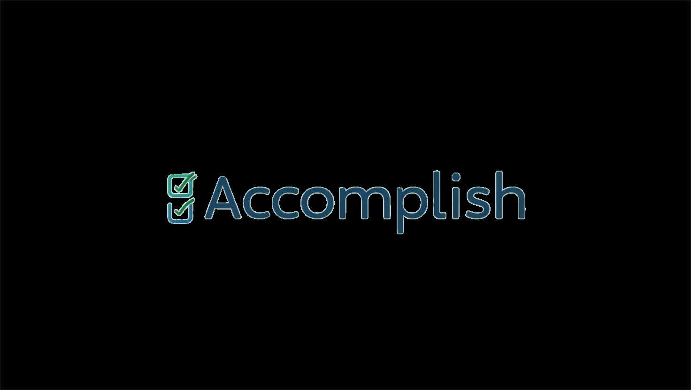

# Accomplish

## Project Overview

Accomplish is a task management tool designed to help users track and organize their tasks, and achieve their goals efficiently.

## Deployed Site & Trello Project Links

Deployed Site: https://accomplish-a23d7a73df7a.herokuapp.com/dashboard/

Trello Wireframes & ERD: https://trello.com/b/WdqVvUV4/accomplish

## Features

- Task creation and management
- Goal setting and tracking
- Progress visualization
- Notifications and reminders

## Installation

1. Fork and Clone the repository

   ```

   ```

2. Navigate to the project directory:
   ```
   cd Accomplish
   ```
3. Install dependencies:
   ```
   npm install
   ```

- django
- psycopg2-binary
- bootstrap@5.3.3
- bootstrap-icons
- python-dotenv
- whitenoise
- gunicorn
- dj-database-url

## Future Enhancements

- Add ability for users to interact with each other - maybe send some positive encouragement
- Update some of the styling to make it more visually appealing and fix carousel transition.
- Extend the User profile more.
- Add default list "My Tasks" and make it the default choice.
- Add accordion to list detail view to break down task priority.

## Sources

- Bootstrap for components
- colormind.ai for color scheme
- Codemy.com to understand django and learn more about updating user profile and password
- Gemini to debug some views and help style Bootstrap
- w3 for some styling
- Canva for logo

## Contact

For any inquiries, please contact [camdelay16@gmail.com](mailto:camdelay16@gmail.com).
